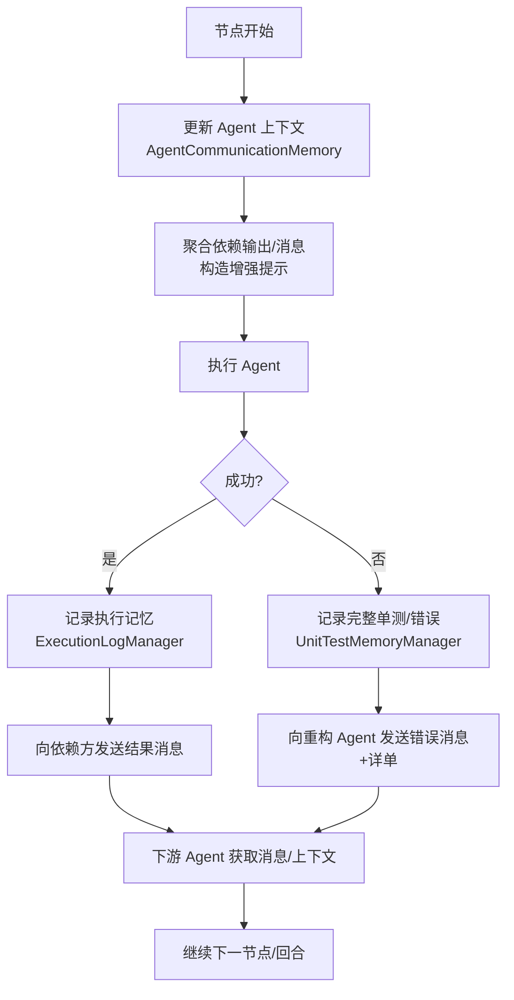

## 项目 Agent Memory 体系（设计、实现与扩展）

### 摘要
本白皮书系统阐述本项目中 Agent Memory 的设计目标、组成模块、数据流与落地实践，并提出可演进方向（如知识图谱、RAG 强化、层次化记忆与治理等）。文档基于当前仓库（src/memory/*、src/core/*、src/utils/*）实现撰写，兼顾工程可操作性与未来扩展性。

---

## 1. 设计目标与原则
- 语义可检索：以向量记忆（ChromaDB）为核心，支持跨回合“相似经验”复用
- 可解释与可回放：单测完整记录、通信上下文与人读日志（Markdown/JSON）相互印证
- 轻耦合高可用：以类与接口分层，编排器通过统一入口读写，不绑定具体引擎
- 安全与治理：元数据规范、导出与备份、脱敏与访问控制，保障合规
- 易扩展：为知识图谱、策略记忆、RAG 注入、层次记忆预留接口与模式

---

## 2. 体系总览与组件职责

核心组件（src/memory/*）：
- ExecutionLogManager：执行语义记忆（向量库，collection=agent_execution_logs）
- AgentCommunicationMemory：协作/依赖/消息/上下文（向量库，collection=workflow_patterns）
- UnitTestMemoryManager：完整单测记忆（raw + 解析 + 智能分析，collection=workflow_patterns）
- AgentStateManager：轻量状态快照（JSON 文件，./memory/agent_states）
- MemoryConfig：统一配置与持久化目录（embedding 模型、k、distance、路径）
- MemoryManager：查询/统计/导出/备份的统一工具层

与编排器（src/core/orchestrator.py、orchestrator_helpers.py）关系：
- 编排器在节点开始/结束钩子读取/写入记忆；在生成“增强提示”时融合依赖输出、消息、项目路径与计划
- 失败路径下，单测→重构的上下文交接由 UnitTestMemoryManager + CommunicationMemory 完成

---

## 3. 存储与配置（ChromaDB + 文件）

- 集合与路径
  - agent_execution_logs → ./memory/execution_logs
  - workflow_patterns → ./memory/workflow_patterns
  - agent_states（JSON） → ./memory/agent_states
- 嵌入/度量/检索
  - 模型：paraphrase-multilingual-MiniLM-L12-v2（384 维，多语言）
  - 距离：cosine；k：执行记忆=50，工作流模式=3；score_threshold=0.0

关键配置摘录：
<augment_code_snippet path="src/memory/memory_config.py" mode="EXCERPT">
````python
return ChromaDBVectorMemory(
    config=PersistentChromaDBVectorMemoryConfig(
        collection_name="agent_execution_logs",
        persistence_path=str(self.execution_logs_path),
        k=50, score_threshold=0.0, distance_metric="cosine",
        embedding_function_config=SentenceTransformerEmbeddingFunctionConfig(
            model_name="paraphrase-multilingual-MiniLM-L12-v2"
        ),
    )
)
````
</augment_code_snippet>

---

## 4. 组件详解

### 4.1 ExecutionLogManager（执行语义记忆）
- 作用：记录每个 Agent 的“可检索语义摘要”与元数据；支持相似执行与错误解决检索
- 写入：record_execution(agent_name, task_description, execution_result, success, duration, context)
- 检索：get_similar_executions(query, agent_name, success_only, top_k)、get_error_solutions(error_description)
- 直接使用底层 Chroma collection.query 规避上层 SDK 已知问题

片段：
<augment_code_snippet path="src/memory/base_memory_manager.py" mode="EXCERPT">
````python
query_results = collection.query(
    query_texts=[search_query],
    n_results=top_k
)
...  # 组装 MemoryContent，附加 distance/similarity
````
</augment_code_snippet>

使用建议：
- 写入 content 要包含关键术语/文件名/错误摘要；metadata 记录 agent_name/success/timestamp/duration/task_type
- 优先用 get_error_solutions 聚合若干查询策略的成功案例

### 4.2 AgentCommunicationMemory（协作与消息记忆）
- 作用：持久化“Agent 上下文（任务、状态、依赖、输出）”与“跨 Agent 消息（context/error/result/advice）”，便于回放与依赖输出聚合
- 与编排器交互：节点开始/结束更新上下文；失败/成功后把摘要消息发送给依赖方
- 检索：get_agent_context、get_messages_for_agent、get_conversation_between_agents、get_dependency_outputs、suggest_next_actions

片段：
<augment_code_snippet path="src/memory/agent_communication_memory.py" mode="EXCERPT">
````python
await self.communication_memory.add(
    MemoryContent(
        content=content,
        mime_type=MemoryMimeType.TEXT,
        metadata={"type": "agent_context", "agent_name": context.agent_name, ...}
    )
)
````
</augment_code_snippet>

设计要点：
- 依赖关系由链路配置注入（orchestrator._configure_agent_dependencies）
- 建议/下一步动作基于依赖完成度、收到消息类型与最近上下文

### 4.3 UnitTestMemoryManager（完整单测记忆）
- 作用：以“可复用、可解释”的格式记录单测完整信息（raw + 解析 + 分析 + 建议 + 文件/报告）
- 面向重构：提供 get_detailed_test_info_for_refactoring，直接输出“重构指导包”（失败模式、修复建议、错误详情）

片段：
<augment_code_snippet path="src/memory/unit_test_memory_manager.py" mode="EXCERPT">
````python
complete_test_record = {
  "raw_output": raw_output,
  "parsed_output": parsed_output,
  "analysis": self._analyze_test_results(parsed_output, success),
  "test_files": test_files or [],
  ...
}
````
</augment_code_snippet>

### 4.4 AgentStateManager（JSON 轻量状态）
- 作用：保存/加载 Agent 状态快照，便于任务中断恢复或调试
- 路径：./memory/agent_states/{agent}_state.json

片段：
<augment_code_snippet path="src/memory/base_memory_manager.py" mode="EXCERPT">
````python
with open(state_file, 'w', encoding='utf-8') as f:
    json.dump(state_with_timestamp, f, indent=2, ensure_ascii=False)
````
</augment_code_snippet>

### 4.5 MemoryManager（统一管理工具）
- 列表/搜索：list_all_memories、search_memories（支持 agent、成功与否、时间范围）
- 统计：get_memory_statistics（成功率、按 Agent/任务类型分布、时间范围、状态数）
- 导出/备份：export_memories（json/csv）、backup_all_data（执行记忆+状态+统计）

---

## 5. 与编排器的耦合点（上下文生产与消费）

- 初始化：initialize_memory_system → 拉起 Execution/Communication/UnitTest 记忆；注入依赖配置
- 节点开始：update_agent_context(…,"starting")，聚合依赖输出/最近完成上下文/收到消息，形成“增强提示”
- 节点结束：record_execution；根据 success 与依赖关系向后续 Agent 发送 result/error/context
- 单测失败：UnitTest →（消息+详单）→ Refactoring；重构成功后再反馈给 UnitTest

片段（指令缓存与增强提示）：
<augment_code_snippet path="src/core/orchestrator.py" mode="EXCERPT">
````python
self.progress_ledger.current_active_nodes = {selected_node}
self.progress_ledger.node_instructions[selected_node] = instruction
````
</augment_code_snippet>

---

## 6. 数据模型与元数据规范（建议）

- 通用（所有向量写入）：agent_name、success、timestamp、duration
- 执行记忆：task_type（规划/测试/重构/扫描/其他）、可选 context 关键值
- 通信记忆：type ∈ {agent_context, agent_message}；message_type ∈ {context, error, result, advice}
- 单测记忆：type=complete_unit_test、failures_count、errors_count、test_files_count

价值：
- 向量召回 + 元数据过滤 → 快速、可解释、可视化统计

---

## 7. 运维与治理

- 安全：不得写入密钥/凭证/隐私；必要时脱敏（截断/哈希/泛化）
- 访问：限制 ./memory 目录权限；将 Memory 接口服务化并加鉴权
- 生命周期：制定保留周期与归档策略；结合 MemoryManager 导出/备份（定时作业）
- 性能：
  - k 调优：执行记忆 k=50（召回更广），工作流模式 k=3（近邻更准）
  - 内容精炼：执行记忆以“摘要+关键标记”为主，减少噪声
  - 规模增长：可迁移到 ANN 引擎（FAISS/Milvus/Qdrant/PGVector）或云服务

---

## 8. 可演进方向与技术路线

### 8.1 知识图谱（Knowledge Graph, KG）
- 目标：把碎片化的“消息/上下文/测试错误/代码实体/依赖关系”抽取为可查询的图结构
- 基础知识：
  - 表达：三元组 (subject, predicate, object)；可扩展属性（属性图）或语义网（RDF/OWL）
  - 典型技术栈：
    - 图数据库：Neo4j（属性图）、NebulaGraph（分布式属性图）、JanusGraph
    - 语义图库：GraphDB / Blazegraph（RDF/SPARQL）
    - 图计算/查询：Cypher（属性图）、SPARQL（RDF）
  - 模型化方法：
    - 本体（Ontology）：定义实体类别、关系类型、约束和推理规则
    - Schema 设计：围绕“Agent/任务/函数/测试/错误/报告/路径”的域模型
- 实体与关系示例：
  - 实体：Agent、任务、函数/模块、测试用例、错误类型、路径、报告
  - 关系：依赖（Agent→Agent）、覆盖（测试→函数）、定位（错误→文件/行）、修复（错误→提交）
- 实现建议：
  - 抽取层：基于 LLM + 规则从 MemoryContent/日志中抽取三元组；支持增量与幂等
  - 存储层：Neo4j / RDF (GraphDB) / Nebula Graph
  - 同步：编排器事件总线→（抽取器）→ KG；双写到向量库（文本）与图库（结构）
- 用途：
  - 语义+结构联合检索（先图后文，或图→文→RAG）
  - 自动定位“错误→受影响函数/模块→相关测试”，缩短诊断链路
  - 图推理：基于路径/约束/模式自动给出“可能原因与修复候选”

### 8.2 RAG 注入与层次化记忆（Episodic / Semantic / Policy）
- Episodic（情节记忆）：当前任务回合内的高保真片段（现状=Communication/UnitTest）
- Semantic（语义记忆）：跨任务可复用模式与经验（现状=ExecutionLog）
- Policy（策略记忆）：最佳实践、组织规范与落地规则（可在 workflow_patterns 中新增 type=policy）
- 注入方式：在提示构造阶段基于检索结果注入片段（摘要化、去重、去噪）

### 8.3 总结/蒸馏/压缩（Summarization & Distillation）
- 背景：向量库长期增长会引入冗余与噪声
- 路线：
  - 周期性对“相似内容”聚类 → 生成“代表性摘要”替代多条冗余
  - 对单测长输出做结构化索引（错误模板化、参数位点化）

### 8.4 反馈学习（RLHF/行为度量）
- 记录“检索→使用→收益”的闭环信号（如检索片段是否被采用、是否缩短失败回合）
- 以此调整 content 模板、检索参数与模型选择


### 8.5 MCP 知识图谱 Memory 服务器（调研与原理）

本节调研了社区中“基于知识图谱的 MCP Memory 服务器”，并总结其工作原理与与本项目的集成方式。

- 背景：MCP（Model Context Protocol）为 LLM 与外部系统之间的工具/资源/提示交互提供统一协议。Memory 服务器以“工具”的形式将结构化的长期记忆（知识图谱）提供给 LLM/Agent，支持跨会话持久化。

A) neo4j-contrib/mcp-neo4j（mcp-neo4j-memory）
- 仓库：neo4j-contrib/mcp-neo4j
- 服务器族：
  - mcp-neo4j-cypher：自然语言生成并执行 Cypher（图查询）
  - mcp-neo4j-memory：基于 Neo4j 的知识图谱 Memory（支持本地或远程 Neo4j 持久化）
- 传输：STDIO / SSE / HTTP 均可（便于本地与 Web 部署）
- 原理：
  - 将“实体（Entity）/关系（Relation）/属性（Property）”持久化到 Neo4j
  - 通过 MCP tools 暴露写入/查询能力，LLM 在对话中选用相应工具进行读写
  - 跨会话可共享，具备图查询（Cypher）与可视化生态（Bloom/GDS）
- 适配价值：
  - 结构化“人机协作知识”：Agent→任务→代码模块→测试→错误→修复→提交 等
  - 与向量库互补：图结构提供强可解释与可追踪的关系链路

B) shaneholloman/mcp-knowledge-graph（知识图谱 Memory）
- 定位：
  - “Knowledge Graph Memory Server”的改进实现，专注本地开发，可通过 --memory-path 指定持久化位置
  - 兼容任何支持 MCP 或“函数调用”的模型/客户端
- 核心概念（摘录）：
  - Entities：唯一 name、entityType 与 observations 列表（原子事实）
  - Relations：from/to + relationType（使用主动语态）
  - Observations：以字符串存储的离散事实，建议“一事实一观察”
- 典型工具（摘录）：
  - create_entities：批量创建实体（去重）
  - create_relations：批量创建关系（去重）
  - add_observations：为实体追加观察（事实）
- 原理：
  - 以本地文件/轻量存储构建“个人/项目知识图谱”，通过 MCP tools 暴露增删查改能力
  - 面向“持久化记忆”，让 Agent 在不同会话中可持续使用同一知识图谱

C) 官方参考 Memory 服务器（modelcontextprotocol/servers/src/memory）
- 说明：官方“Memory - Knowledge graph-based persistent memory system”参考实现位于 MCP servers 仓库。
- 访问提示：我们尝试自动抓取该页面时被 GitHub robots 限制拦截（可在浏览器中手动打开查看源码与 README）。
- 价值：为“知识图谱型记忆”的标准化实现提供参考，便于迁移/对齐生态最佳实践。

工作机理总览（三步闭环）
- 写入：通过 MCP tools 将“事实”以（Entity/Relation/Observation）的图模型写入（Neo4j 或本地图存储）
- 检索：基于图查询（Cypher）或按实体/关系/模式检索，返回结构化结果供 LLM 消化
- 注入：编排器将检索结果转为“可读上下文片段”，在提示构造阶段注入到后续 Agent 决策中

与向量记忆的互补
- 图记忆：结构化、可解释、可沿路径追因（因果/依赖/覆盖等）
- 向量记忆：语义近邻召回、模糊检索强
- 混合范式：向量检索 → 命中候选 → 关联图探索（Neighborhood/Path）→ 汇总注入（RAG）

在本项目中的落地建议
- 最小集成路径：
  1) 新增 MCP 服务器配置：在 src/config/mcp_config.py 中按 filesystem/code-runner 的方式新增 “mcp-neo4j-memory” 或 “mcp-knowledge-graph”的 Stdio/HTTP 配置
  2) 工具封装：新增 MemoryBridge 工具模块（src/tools/memory_graph_bridge.py），封装 create_entities/create_relations/add_observations 及查询工具
  3) 编排注入：
     - 写入：在节点结束钩子，根据 Agent 类型生成实体/关系，如（UnitTest→Error→File→Function）、（Refactor→Fix→Commit）
     - 查询：在增强提示构造时，基于当前任务/错误关键字调用图查询，返回“相关函数/相关测试/历史修复”
  4) 安全：限定工具参数白名单、对外连接（Neo4j Aura/远端）需加凭证与权限控制
- 渐进增强：
  - 为 ExecutionLog/UnitTest 的核心事实生成“同步三元组”，形成“文本语义 + 图结构”的双存储
  - 引入“图摘要器”，对海量关系做聚合/分层摘要，避免提示过长

适配注意
- 命名规范：实体名建议可逆映射至源文件/测试用例/Agent 名称；关系使用主动语态（例如 tests_covers、refactors、raises_error）
- 幂等/去重：服务端工具应具“存在即跳过”的特性；客户端需具备去重缓存
- 时间维度：可在属性中记录 timestamp 与版本（commit），便于时间序列分析

---

## 9. 典型使用流程（Mermaid 流程图）



---

## 10. 快速清单（Best Practices）
- 写入：内容可读+含关键词；元数据齐全
- 检索：多策略（文本+元数据）；优先成功样本
- 安全：严格脱敏；最小权限
- 运维：定时备份与清理；增长期考虑 ANN/图谱
- 扩展：RAG 注入、策略记忆、KG 联合检索

---

### 附：关键代码入口索引
- 执行记忆：src/memory/base_memory_manager.py（ExecutionLogManager）
- 通信记忆：src/memory/agent_communication_memory.py（AgentCommunicationMemory）
- 单测记忆：src/memory/unit_test_memory_manager.py（UnitTestMemoryManager）
- 统一配置：src/memory/memory_config.py（集合名/路径/k/embedding/度量）
- 管理工具：src/memory/memory_manager.py（列表/搜索/统计/导出/备份）
- 编排入口：src/core/orchestrator.py、src/core/orchestrator_helpers.py（上下文读写与增强提示）

