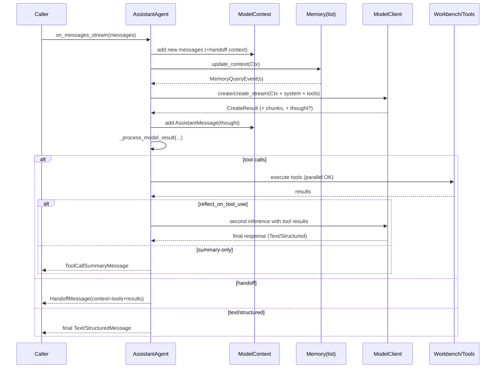

## AssistantAgent 设计白皮书（docs/api/Assistant.py 源码解读）

### 摘要
AssistantAgent 是 Autogen AgentChat 体系内“一般型带工具能力的助手 Agent”。其核心职责是：在可配置的系统提示与模型上下文下，完成一次或多次推理，按需并行/串行调用工具（或通过 Workbench/MCP 提供的工具集），可选择将工具结果直接返回或进行“反思式（reflect）二次推理”来产出最终文本/结构化响应；同时支持 Handoff（将上下文/工具结果移交给其他 Agent）、流式输出、记忆注入与上下文裁剪。本文以源码为依据，系统讲解其状态管理、消息流、工具/移交规范、结构化输出与可扩展点。

---

## 1. 定位与角色
- 目标：充当“带工具的对话执行体”，可单兵作战，也可加入团队由编排器调度。
- 能力：
  - 工具调用（FunctionTool/Workbench 工具/MCP 工具），支持并行调用
  - Handoff 转交（带上下文与工具结果）
  - 结构化输出（Pydantic 模型）
  - 模型流式输出（chunk 事件）
  - 记忆查询并注入模型上下文
  - 限制上下文长度（Buffered/TokenLimited ChatCompletionContext）
- 重要特性：保持内部会话状态（caller 只需传增量消息）；非线程安全/协程安全（不得并发复用）。

代码片段（类头与定位）：
<augment_code_snippet path="docs/api/Assistant.py" mode="EXCERPT">
````python
class AssistantAgent(BaseChatAgent, Component[AssistantAgentConfig]):
    """An agent that provides assistance with tool use."""
````
</augment_code_snippet>

---

## 2. 生命周期与消息流

设计要点：
- on_messages 会调用 on_messages_stream 并等待最终 Response；
- on_messages_stream 是核心：
  1) 把新消息加入 model_context（含 HandoffMessage 上下文展开）
  2) 使用 Memory.update_context 注入记忆内容（产生 MemoryQueryEvent）
  3) 进行第一次模型推理（可流式），产出 CreateResult 与可选“thought”
  4) 将 AssistantMessage（含 thought）写回 model_context
  5) 处理模型结果：
     - 若返回工具调用：执行（可并行）→ 反思推理（可选）或总结为 ToolCallSummaryMessage
     - 若触发 handoff：执行工具后返回 HandoffMessage，携带上下文给目标 Agent
     - 若直接文本/结构化输出：作为最终 chat_message 返回

序列图（主干流程）：


---

## 3. 工具/Workbench/Handoff 设计

### 3.1 工具与并行
- 支持传入 BaseTool / 可调用函数（自动包装为 FunctionTool）；
- 并行工具调用由底层 model client 控制（如 OpenAIChatCompletionClient 设置 parallel_tool_calls=False 可禁用）；
- 最多迭代次数 max_tool_iterations 控制“工具-推理”的串行轮数（默认1，一次工具回合后结束）。

片段：
<augment_code_snippet path="docs/api/Assistant.py" mode="EXCERPT">
````python
self._max_tool_iterations = max_tool_iterations
if self._max_tool_iterations < 1:
    raise ValueError(...)
````
</augment_code_snippet>

### 3.2 Workbench
- 若提供 Workbench（含 MCP Workbench），则不能同时提供 tools；
- 未提供 Workbench 时，内部用 StaticStreamWorkbench(self._tools) 将工具集成一致抽象；
- 调用时通过 workbench.list_tools() 聚合工具 + handoff_tools。

片段：
<augment_code_snippet path="docs/api/Assistant.py" mode="EXCERPT">
````python
if workbench is not None:
    if self._tools:
        raise ValueError("Tools cannot be used with a workbench.")
else:
    self._workbench = [StaticStreamWorkbench(self._tools)]
````
</augment_code_snippet>

### 3.3 Handoff
- handoffs 可为字符串（目标 Agent 名）或 HandoffBase；
- Handoff 作为一种“特殊工具”加入 handoff_tools；
- 当检测到 handoff：
  - 若有工具调用，会先执行工具；
  - 返回 HandoffMessage，并在 context 中附带工具调用与结果，供目标 Agent 消费；
- 限制：并行工具调用时建议关闭以避免“多 handoff 同时触发”。

---

## 4. 结构化输出与反思式工具使用

- output_content_type（Pydantic 模型）开启“结构化输出模式”：
  - 最终 chat_message 默认为 StructuredMessage；
  - 该模式下 reflect_on_tool_use 默认为 True（先工具，再二次推理生成结构化输出）；
- 若 reflect_on_tool_use=False 且发生工具调用：最终返回 ToolCallSummaryMessage；
- 可通过 tool_call_summary_format 或 tool_call_summary_formatter 自定义摘要（formatter 不可序列化）。

片段：
<augment_code_snippet path="docs/api/Assistant.py" mode="EXCERPT">
````python
if self._output_content_type is not None and reflect_on_tool_use is None:
    self._reflect_on_tool_use = True
elif reflect_on_tool_use is None:
    self._reflect_on_tool_use = False
````
</augment_code_snippet>

---

## 5. 模型上下文、记忆与流式输出

- 模型上下文：默认 UnboundedChatCompletionContext，可替换为 Buffered/TokenLimited 以限制长度。
- 记忆：Sequence[Memory]，在推理前调用 mem.update_context(context) 将检索结果注入模型上下文，并产出 MemoryQueryEvent 便于可视化审计。
- 流式输出：model_client_stream=True 时，on_messages_stream 会产出 ModelClientStreamingChunkEvent，最终仍返回完整 Response。
- Reasoning/思维：当模型返回“thought”，会以 ThoughtEvent 的形式产生事件并写回上下文。

片段（记忆注入）：
<augment_code_snippet path="docs/api/Assistant.py" mode="EXCERPT">
````python
for mem in memory:
    update_context_result = await mem.update_context(model_context)
    if update_context_result and len(update_context_result.memories.results) > 0:
        memory_query_event_msg = MemoryQueryEvent(...)
````
</augment_code_snippet>

---

## 6. 兼容性与安全约束

- 模型能力检查：
  - 无 function_calling 模型禁止设置 tools/handoffs（如 o1-mini）
  - o1 系列不支持 system message
- 并发与状态：
  - Agent 保持内部状态，caller 不应重复传历史；
  - 非线程安全/协程安全，避免并发调用同一实例
- 名称唯一性：
  - 工具名必须唯一；handoff 名必须唯一，且与工具名不冲突；字符串 handoff 的 target 不得与工具名重复

片段（唯一性校验）：
<augment_code_snippet path="docs/api/Assistant.py" mode="EXCERPT">
````python
if len(tool_names) != len(set(tool_names)):
    raise ValueError("Tool names must be unique")
...
if overlap:
    raise ValueError("Handoff names must be unique from tool names")
````
</augment_code_snippet>

---

## 7. 工具调用控制流（Flow）

```mermaid
flowchart TD
  A[收到消息] --> B[加入 ModelContext]
  B --> C[Memory.update_context]
  C --> D[LLM 第一次推理]
  D -->|无工具| E[直接 Text/Structured 返回]
  D -->|工具调用| F[执行工具(可并行)]
  F --> G{reflect_on_tool_use?}
  G -- 否 --> H[ToolCallSummaryMessage 返回]
  G -- 是 --> I[二次推理(带工具结果)]
  I --> J[Text/Structured 返回]
  D -->|handoff| K[执行工具后返回 HandoffMessage]
```

---

## 8. 可扩展点与最佳实践

- 自定义 model_context：针对推理模型（例如 R1）可在 get_messages() 过滤思维字段，减小污染
- 结构化输出：配合严格工具 schema（FunctionTool strict=True）保证类型一致性
- 负载与并行：大规模工具并行需关注模型客户端/工作台的并发限制与超时
- 观测与审计：启用 MemoryQueryEvent/ThoughtEvent/ToolCallSummaryMessage 的持久化日志，便于复盘
- 团队协作：配合编排器（如 Magentic-One 团队）使用，AssistantAgent 常作“执行体”负责工具/工作台调用

---

## 9. 关键源码摘录索引

- 类定义与文档：docs/api/Assistant.py（类注释详述所有行为、模式与示例）
- 结构化输出工厂：StructuredMessageFactory（由 output_content_type 激活）
- 一次/多次工具回合：max_tool_iterations（>1 允许工具-推理多轮）
- 并行工具：由模型客户端配置（parallel_tool_calls）
- 记忆注入：mem.update_context → MemoryQueryEvent
- 流式：create_stream → ModelClientStreamingChunkEvent
- Handoff：HandoffBase.handoff_tool + HandoffMessage(context=tools+results)

代码片段（工具+handoff 聚合）：
<augment_code_snippet path="docs/api/Assistant.py" mode="EXCERPT">
````python
all_messages = await model_context.get_messages()
llm_messages = cls._get_compatible_context(...)
tools = [tool for wb in workbench for tool in await wb.list_tools()] + handoff_tools
model_result = await model_client.create(..., tools=tools, ...)
````
</augment_code_snippet>

---

### 结语
AssistantAgent 通过“状态化上下文 + 可并发工具 + 反思式二次推理 + Handoff 移交”的组合，兼顾了易用性与工程可控性。结合 Workbench/MCP 与结构化输出，它既是单体助手，也可作为团队执行体融入编排工作流。合理设置 max_tool_iterations/reflect_on_tool_use 与上下文裁剪，可在性能与质量间取得平衡。
