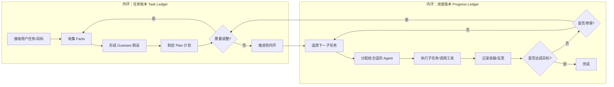
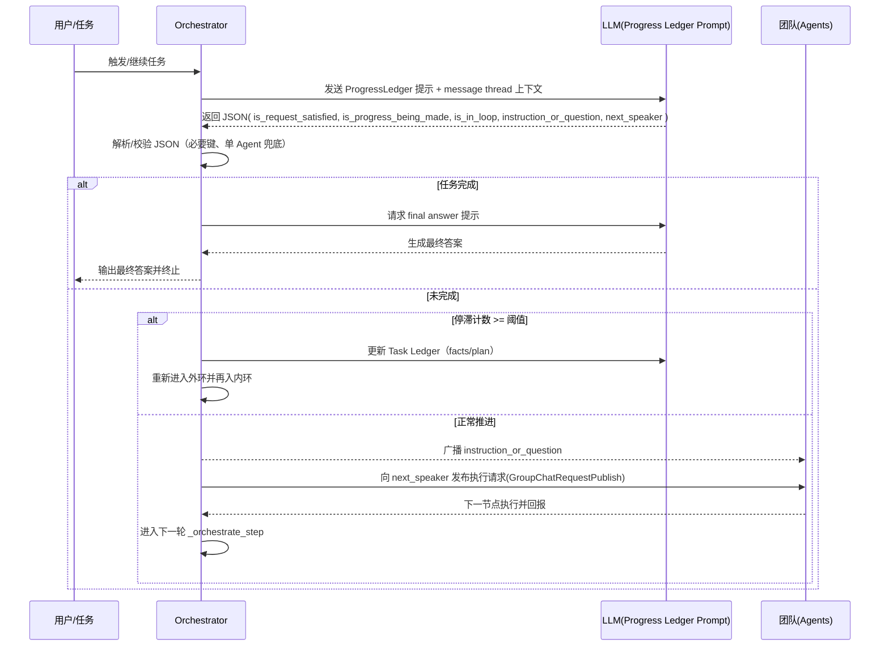
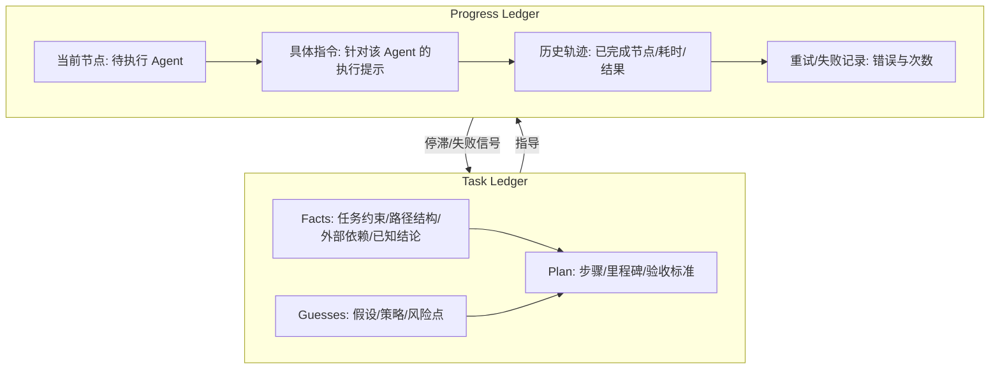

## Magentic-One 思想与本项目应用白皮书

### 摘要
本文基于官方资料与本仓库实现，系统讲解 Magentic-One（微软提出的通用多智能体系统）的核心思想、架构范式与安全实践，并对照本项目中已落地的账本机制、编排方式、工具能力（MCP）、记忆系统与专业 Agent，给出映射关系、差异与演进建议。

参考资料（节选）：
- Microsoft Research 文章：Magentic-One: A Generalist Multi-Agent System for Solving Complex Tasks（2024-11，2025-07 更新）
- AutoGen 官方文档：Magentic-One — autogen-agentchat 文档
- AutoGen 仓库：microsoft/autogen（Magentic-One 示例与团队组件）

---


> 注：官方文章配图展示了双循环（外环=任务账本、内环=进度账本）的整体流程。建议在阅读时对照下述概念解释理解图片。本文不直接内嵌图片，可在微软研究院文章页面查看高清图示。

## 1. 官方理念速读

- 多智能体编排（Orchestrator + Specialists）
  - 由 Orchestrator 规划、分配、跟踪、重试与再规划，指挥专业 Agent（WebSurfer、FileSurfer、Coder、Terminal 等）完成开放域任务
- 双层循环与双账本（Two Loops, Two Ledgers）
  - 外环/任务环：维护 Task Ledger（facts/guesses/plan）
  - 内环/进度环：维护 Progress Ledger（当前进度、节点分配与状态）
- 面向任务的可插拔团队
  - 类似面向对象的“能力封装”，按需增删特定 Agent，无需重写整套系统
- 错误恢复与再规划
  - 监控进度，遇错即“重试→再规划→继续推进”
- 安全基线（官方提示）
  - 容器隔离、虚拟环境、日志监管、人类在环、最小权限、谨防提示注入

---

### 1.1 双循环与双账本（配图解读引导）

- 外环（任务账本 Task Ledger）
  - 记录：Facts（客观事实）、Guesses（合理猜测/假设）、Plan（可执行计划）
  - 职责：承载“问题求解的全局态”，指导下一阶段的策略；当内环停滞时，外环负责“更新事实/假设、重排计划”
- 内环（进度账本 Progress Ledger）
  - 记录：当前进展、已完成/在途子任务、分配给哪个 Agent、每步的反思与状态
  - 职责：确保计划逐步推进，必要时触发重试或反馈“停滞”给外环
- 二者关系：外环制定策略与更新认知，内环逐步推动执行与反馈；当内环多步无进展 → 外环重构计划

结合本项目：
- TaskLedger 承载 facts/plan（以及工程路径、主/测文件等任务语境），ProgressLedger 承载“当前节点、具体执行指令、历史轨迹与重试计数”。
- Orchestrator 中 `_intelligent_node_selection` 生成“下一节点 + 具体指令”，并写入 `progress_ledger.node_instructions`，呼应官方“内环推进 + 反思”的理念。


### 1.2 官方流程 Mermaid 复刻图（双循环 + 账本）



说明：
- 外环维护 Facts/Guesses/Plan，遇到停滞信号由内环回传给外环进行再规划
- 内环维护“子任务分配、执行记录、反思与状态”，在推进中不断产出“是否达成/是否停滞”的信号


### 1.3 源码解析：如何选择下一说话者/节点（docs/examples/_magentic_one_orchestrator.py）

核心位置：`_orchestrate_step`（内环）。流程概述：
- 构造上下文（message thread → LLMMessage 列表）
- 以 ORCHESTRATOR_PROGRESS_LEDGER_PROMPT 提示 LLM 输出“进度账本”结构化 JSON（含 is_request_satisfied、is_progress_being_made、is_in_loop、instruction_or_question、next_speaker）
- 解析 JSON（extract_json_from_str），重试直至满足键结构；单 Agent 时直接指定 next_speaker
- 若任务已完成 → 生成最终答案；若停滞次数超阈 → 外环更新 task ledger 并再入内环
- 否则：发布 instruction_or_question，并将 next_speaker 的请求投递到其 topic，驱动下一节点执行

片段A：生成进度账本提示并请求结构化输出
<augment_code_snippet path="docs/examples/_magentic_one_orchestrator.py" mode="EXCERPT">
````python
progress_ledger_prompt = self._get_progress_ledger_prompt(
    self._task, self._team_description, self._participant_names
)
context.append(UserMessage(content=progress_ledger_prompt, source=self._name))
progress_ledger: Dict[str, Any] = {}
````
</augment_code_snippet>

片段B：解析 LLM 返回的“进度账本”JSON（只允许单对象，校验必备键）
<augment_code_snippet path="docs/examples/_magentic_one_orchestrator.py" mode="EXCERPT">
````python
ledger_str = response.content
output_json = extract_json_from_str(ledger_str)
if len(output_json) != 1:
    raise ValueError("Progress ledger should contain a single JSON object")
progress_ledger = output_json[0]
# required: is_request_satisfied, is_progress_being_made, is_in_loop,
# instruction_or_question, next_speaker (均含 answer/reason)
````
</augment_code_snippet>

片段C：向下一说话者发布执行请求（并广播指令给全队）
<augment_code_snippet path="docs/examples/_magentic_one_orchestrator.py" mode="EXCERPT">
````python
message = TextMessage(content=progress_ledger["instruction_or_question"]["answer"], source=self._name)
next_speaker = progress_ledger["next_speaker"]["answer"]
participant_topic_type = self._participant_name_to_topic_type[next_speaker]
await self.publish_message(GroupChatRequestPublish(),
    topic_id=DefaultTopicId(type=participant_topic_type),
    cancellation_token=cancellation_token)
````
</augment_code_snippet>

要点：
- 选择逻辑由 LLM 决策，但通过“结构化账本格式 + 键校验 + 单 Agent 兜底 + 停滞阈值回退（重规划）”保证可控性与鲁棒性。
- 本项目的 Orchestrator 也采用“LLM 生成下一节点与具体指令 → 进度账本缓存指令 → 广播执行”的模式，思想与官方一致。


#### 1.3.1 选择下一节点的时序图（Mermaid）




## 2. 本项目与 Magentic-One 的映射

- Orchestrator（编排核心）：本项目 `src/core/orchestrator.py` 承担“下一节点选择 + 指令生成 + 账本更新 + 失败消息中转”
- 双账本：TaskLedger + ProgressLedger，贯穿规划与推进
- 专业 Agent 团队：规划、编码、测生、单测、重构、扫描、结构分析（7 角队）
- 工具与外部能力：MCP 文件系统 + 代码运行（已接入）；扫描/Fetch MCP 具备能力待接入主流程
- 记忆层：
  - 语义日志（ExecutionLogManager，agent_execution_logs）→ 相似任务/错误检索
  - 协作/消息/单测（workflow_patterns）→ 跨 Agent 上下文回放与重构指导

对齐点：
- 双账本范式一致；
- Orchestrator 的“智能节点选择/指令生成”呼应官方“内环进度编排”；

### 3.1 账本内容结构 Mermaid 复刻图



结合本项目：
- TaskLedger 暴露 `get_file_path/get_intelligent_path_resolver` 等工程上下文供计划/提示引用
- ProgressLedger 中的 `node_instructions` 保存由编排器生成的“具体执行指令”，驱动下一步 Agent 的可执行上下文

- 以工具（MCP + FunctionTool）扩展专业技能；
- 以持久化记忆支持“再规划与知识复用”。

---

## 3. 双账本在本项目中的体现

- 账本实例化（Orchestrator 初始化）：
<augment_code_snippet path="src/core/orchestrator.py" mode="EXCERPT">
````python
self.task_ledger = TaskLedger()
self.progress_ledger = ProgressLedger()
````
</augment_code_snippet>

- 为“下一节点”缓存具体执行指令（进度环）：
<augment_code_snippet path="src/core/orchestrator.py" mode="EXCERPT">
````python
self.progress_ledger.current_active_nodes = {selected_node}
self.progress_ledger.node_instructions[selected_node] = instruction
````
</augment_code_snippet>

- 路径与工程上下文（任务环）通过账本提供统一口径：
<augment_code_snippet path="src/core/data_structures.py" mode="EXCERPT">
````python
def get_file_path(self, file_type: str) -> str:
    if file_type == "main":
        return self.project_config.get("main_file_path", "/Users/jabez/output/main.py")
````
</augment_code_snippet>

---

## 4. 专业 Agent 团队（与官方“可插拔团队”思想对齐）

- 链路配置（部分节选）：
<augment_code_snippet path="src/config/chain_config.py" mode="EXCERPT">
````python
configs["standard"] = ChainConfig(
  agents=["CodePlanningAgent","FunctionWritingAgent","TestGenerationAgent",
          "UnitTestAgent","RefactoringAgent","CodeScanningAgent","ProjectStructureAgent"])
````
</augment_code_snippet>

- Agent 工厂映射：
<augment_code_snippet path="src/agents/chain_factory.py" mode="EXCERPT">
````python
self._agent_creators = {
  "CodePlanningAgent": create_planning_agent,
  "FunctionWritingAgent": create_coding_agent,
}
````
</augment_code_snippet>

说明：本项目采用“按链路场景组装团队”的方式（prototype/minimal/standard/quality），体现了 Magentic-One 的“按需组合与替换”的工程价值。

---

## 5. 工具接入与 MCP（与官方“工具选择/资源/提示”一致）

- 已接入 MCP：文件系统、代码运行
<augment_code_snippet path="src/config/mcp_config.py" mode="EXCERPT">
````python
filesystem_mcp_server = StdioServerParams(
  command="node",
  args=[".../filesystem-mcp-server/dist/index.js", "/Users"],
)
````
</augment_code_snippet>

- 扫描/Fetch MCP：工程存在实现与工作台，主流程待接入（可作为“可插拔能力”逐步纳入）
- FunctionTool：为扫描等内部工具提供快速扩展位（与 MCP 工具并行）

---

## 6. 记忆与再规划（与官方“从错误恢复”思想呼应）

- 语义执行记忆（向量）：
<augment_code_snippet path="src/memory/memory_config.py" mode="EXCERPT">
````python
collection_name="agent_execution_logs",
distance_metric="cosine",
````
</augment_code_snippet>

- 单测完整记忆 → 重构指导包：
<augment_code_snippet path="src/memory/unit_test_memory_manager.py" mode="EXCERPT">
````python
async def record_complete_test_execution(...):
    if not self._initialized:
        await self.initialize()
````
</augment_code_snippet>

- 通信记忆（上下文与消息总线）：
<augment_code_snippet path="src/memory/agent_communication_memory.py" mode="EXCERPT">
````python
await self.communication_memory.add(MemoryContent(..., metadata={"type":"agent_context"}))
````
</augment_code_snippet>

价值：失败→分析→再规划→继续推进的“弹性闭环”。

---

## 7. 安全实践（结合官方建议）

- 隔离与权限
  - 在代码执行、网络访问等环节启用容器/虚拟环境与最小权限
- 监管与人类在环
  - 打开详细日志（WorkflowLogger），关键步骤人工确认
- MCP 工具安全
  - 严格限定工具参数白名单；外部服务使用凭证与网络边界控制
- 提示注入防护
  - 对网页/外部文本进行降权与过滤；禁止隐式授权

---

## 8. 差异与改进方向（向 Magentic-One 进一步对齐）

- 自动选链/自适应编排
  - 官方强调“Orchestrator 持续再规划与分配”；本项目可将 TaskComplexityAnalyzer 产出接入入口，自动选择链路（prototype/minimal/standard/quality）
- 工具选择的动态化
  - 将 code-scanner/fetch 等 MCP 真接入当前 Agent toolset，运行期按任务决定是否调用
- 可视化账本与回放
  - 补充 UI/报告将 Task/Progress Ledger 可视化，提升“人类在环”效能
- 知识图谱 Memory（MCP）
  - 引入 mcp-neo4j-memory 或本地 knowledge-graph server，将“函数-测试-错误-修复-提交”结构化，和向量记忆形成互补（见 Agent_Memory 白皮书 8.5 节）

---

## 9. 项目落地范式（建议实践）

- 默认：standard 链路（7 Agent），顺序执行 + 智能节点选择/指令缓存
- 加强：
  1) 接 TaskComplexityAnalyzer → 自动选链；
  2) 接入扫描/Fetch MCP → 丰富工具池；
  3) 将失败上下文（UnitTest 详单、ExecutionLog 相似案例）自动注入提示 → 提升一次修复率；
  4) 引入知识图谱 Memory → 建立“结构可解释 + 语义可检索”的双记忆层。

---

## 10. 参考链接
- Microsoft Research: Magentic-One 文章（2024/2025 更新）
- AutoGen 文档：Magentic-One — AgentChat 版本
- GitHub: microsoft/autogen（包含 MagenticOneGroupChat 等）

> 本文将官方 Magentic-One 的“编排-账本-工具-安全”思想映射到本项目：账本与编排已成型，工具与记忆具备基础，后续可围绕“自动选链、MCP 丰富化、知识图谱记忆、可视化与治理”持续迭代，使系统更接近官方范式与工程可控性。

