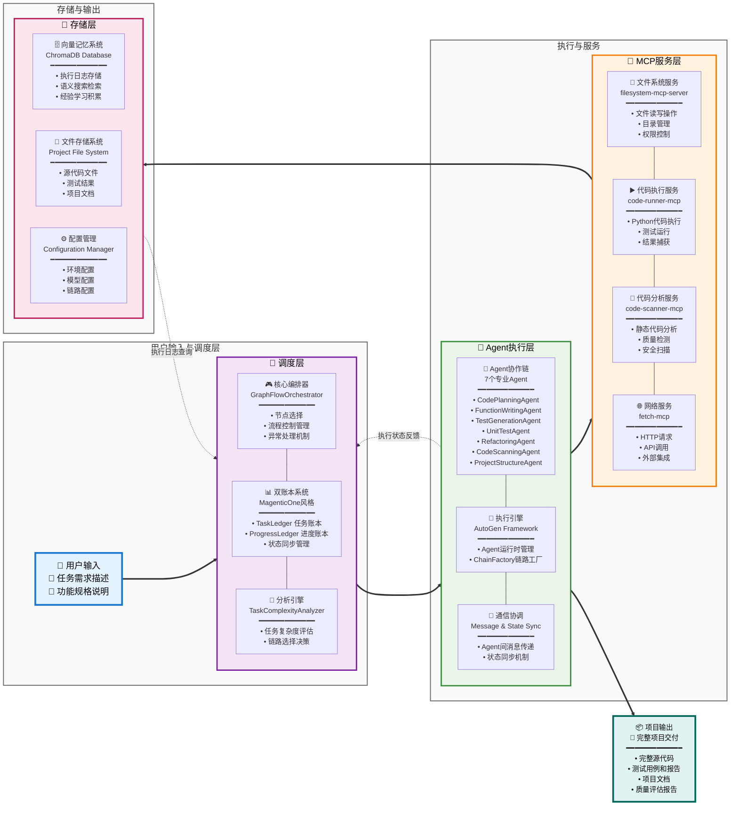
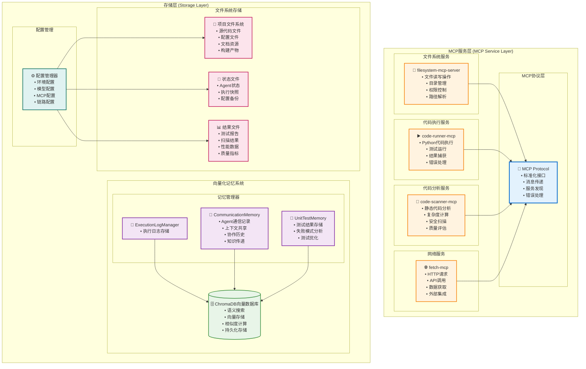
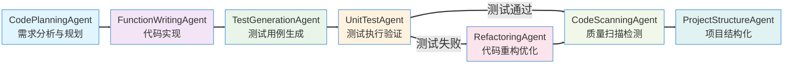
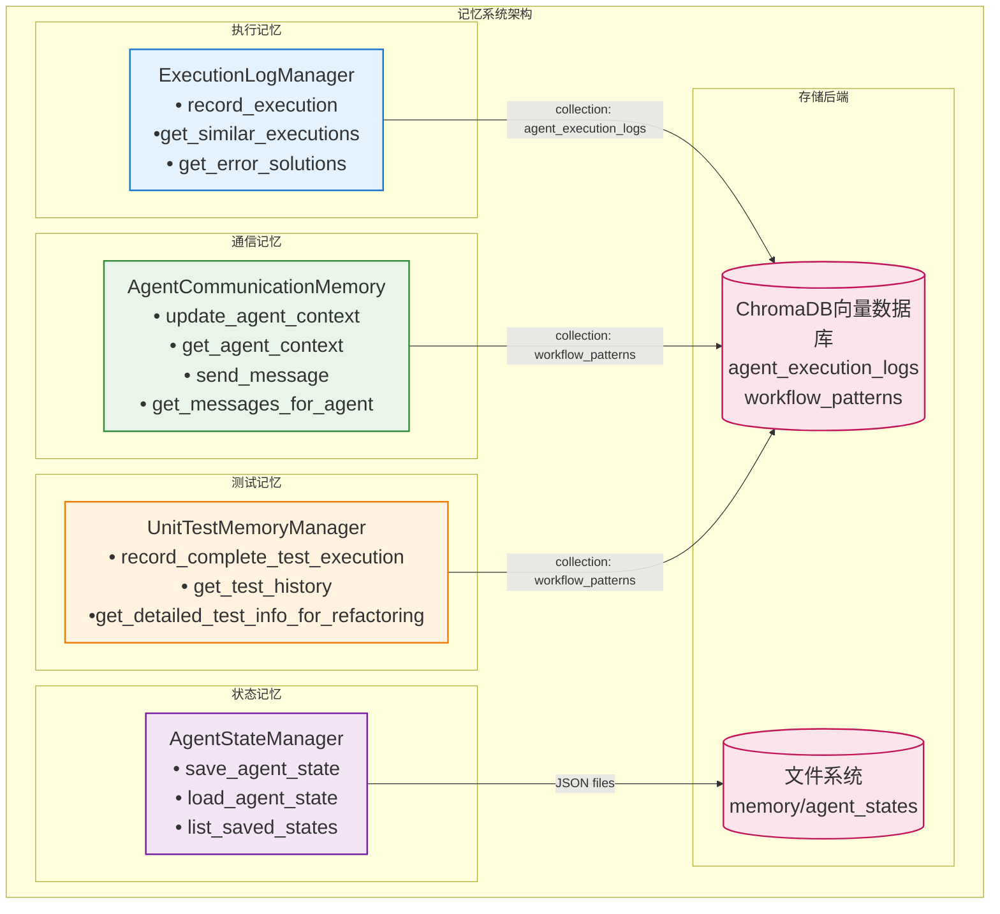
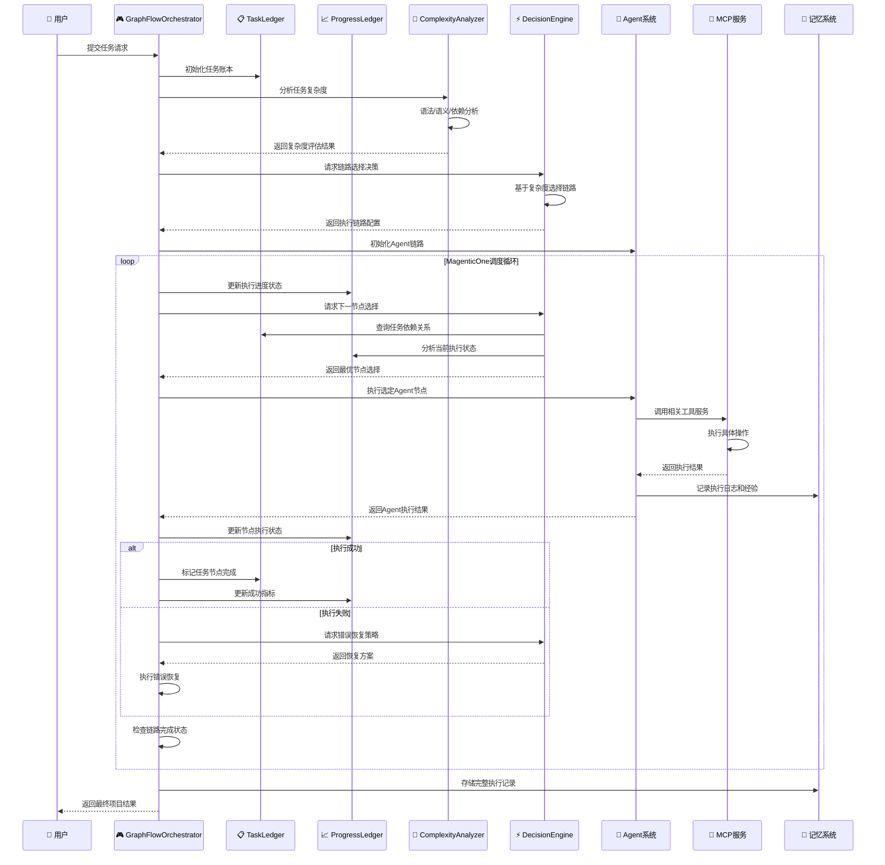

# 基于MCP的多链代码生成智能体Agent开发课题总结

## 课题概述

本课题设计并实现了一个基于 MCP(Model Context Protocol)的多链代码生成智能体系统，结合 AutoGen 框架中的 GraphFlow 结构化执行和 MagenticOne 双账本风格调度，实现了从需求分析到代码生成、测试、重构、质量扫描的自动化开发工作流。
## GitHub 地址
https://github.com/Jabez2/-MCP-Agent
## 核心工作

- **多链路支持**：支持不同复杂度的执行链路，可根据任务复杂度选择最优路径
- **MCP服务集成**：集成多个专业MCP服务，实现Agent工具能力扩展
- **向量化记忆**：基于ChromaDB向量数据库记忆存储，支持 Agent 上下文共享和执行记录存储
- **双账本状态管理**：TaskLedger + ProgressLedger 实现任务层和执行层的状态记录

## 系统架构

### 整体架构图



</div>

**架构特点**：

- **调度层**：MagenticOne双账本机制 + 决策引擎
- **Agent执行层**：7个专业Agent协作 + AutoGen执行引擎
- **MCP服务层**：标准化工具服务 + 模块化扩展
- **存储层**：向量化记忆 + 文件系统 + 配置管理

### MagenticOne双账本机制


#### 双账本机制核心特性

1. **TaskLedger (任务账本)**：
   - **任务分解**：将复杂任务分解为可执行的子任务
   - **依赖管理**：维护任务间的依赖关系和执行顺序
   - **全局状态**：实时跟踪整体任务执行状态

2. **ProgressLedger (进度账本)**：
   - **执行监控**：实时监控每个Agent的执行状态
   - **性能分析**：收集和分析执行性能指标
   - **瓶颈识别**：识别执行过程中的瓶颈点
   - **优化建议**：基于历史数据提供执行优化建议

3. **决策机制**：
   - **进度分析**：综合分析任务和进度信息
   - **节点选择**：基于当前状态选择下一个执行节点
   - **错误恢复**：包含多种错误检测和错误恢复策略

### 分层架构详细设计

#### 调度层 (Orchestration Layer) - 图结构与账本分析融合

```mermaid
graph TB
    subgraph "🎯 调度层 - 图结构驱动的智能调度"
        subgraph "📊 图结构分析引擎"
            GraphAnalyzer[GraphStructureAnalyzer<br/>🕸️ 图结构分析器<br/>• 依赖图拓扑排序<br/>• 关键路径识别<br/>• 并行节点发现<br/>• 循环依赖检测]

            PathOptimizer[PathOptimizer<br/>🛤️ 路径优化器<br/>• 最短路径计算<br/>• 负载均衡路径<br/>• 容错路径规划<br/>• 动态路径调整]
        end

        subgraph "核心编排器"
            Orchestrator[GraphFlowOrchestrator<br/>🎮 主控制器<br/>• 图遍历策略<br/>• 节点状态机管理]
            ChainSelector[ChainSelector<br/>🔄 链路选择器<br/>• 基于图复杂度选链<br/>• 动态链路切换]
            NodeScheduler[NodeScheduler<br/>📅 节点调度器<br/>• 图拓扑调度<br/>• 并行执行协调]
        end

        subgraph "🔄 MagenticOne双账本系统"
            TaskLedger[TaskLedger<br/>📋 任务账本 (图结构层)<br/>━━━━━━━━━━━━━<br/>• 任务依赖图构建<br/>• 节点优先级计算<br/>• 图完整性验证<br/>• 全局进度追踪]

            ProgressLedger[ProgressLedger<br/>📈 进度账本 (执行状态层)<br/>━━━━━━━━━━━━━<br/>• 节点执行状态实时更新<br/>• 图遍历性能监控<br/>• 瓶颈节点识别<br/>• 执行路径优化建议]
        end

        subgraph "🧠 融合决策分析"
            ComplexityAnalyzer[TaskComplexityAnalyzer<br/>🧠 复杂度分析器<br/>━━━━━━━━━━━━━<br/>• 图结构复杂度 (节点数/边数)<br/>• 语义复杂度 (任务难度)<br/>• 依赖复杂度 (关键路径长度)<br/>• 并行度评估 (可并行节点比例)]

            ProgressAnalyzer[ProgressAnalyzer<br/>📊 进度分析器<br/>━━━━━━━━━━━━━<br/>• 图遍历效率分析<br/>• 节点执行性能统计<br/>• 关键路径瓶颈识别<br/>• 并行执行效果评估]
        end

        subgraph "⚡ 图感知决策引擎"
            DecisionEngine[DecisionEngine<br/>⚡ 决策引擎<br/>━━━━━━━━━━━━━<br/>• 基于图拓扑的节点选择<br/>• 考虑依赖约束的调度<br/>• 并行执行机会识别<br/>• 关键路径优先策略]

            ErrorHandler[ErrorHandler<br/>🛡️ 错误处理器<br/>━━━━━━━━━━━━━<br/>• 图结构感知的错误恢复<br/>• 依赖链断裂修复<br/>• 替代路径自动切换<br/>• 回滚点智能选择]
        end
    end

    %% 图结构分析流
    GraphAnalyzer --> PathOptimizer
    GraphAnalyzer --> TaskLedger
    PathOptimizer --> DecisionEngine

    %% 核心编排流
    Orchestrator --> ChainSelector
    Orchestrator --> NodeScheduler
    Orchestrator --> GraphAnalyzer

    %% 双账本交互 (核心优势)
    TaskLedger <==> ProgressLedger
    TaskLedger --> GraphAnalyzer

    %% 分析引擎融合
    ComplexityAnalyzer --> DecisionEngine
    ProgressAnalyzer --> DecisionEngine
    TaskLedger --> ComplexityAnalyzer
    ProgressLedger --> ProgressAnalyzer

    %% 决策执行
    DecisionEngine --> NodeScheduler
    ErrorHandler --> NodeScheduler
    DecisionEngine --> ErrorHandler

    %% 反馈循环 (图结构优化)
    ProgressLedger -.->|性能反馈| PathOptimizer
    ErrorHandler -.->|错误模式| GraphAnalyzer

    %% 样式定义
    classDef graphStyle fill:#e8f5e8,stroke:#2e7d32,stroke-width:4px,font-size:18px
    classDef orchestratorStyle fill:#e3f2fd,stroke:#1976d2,stroke-width:3px,font-size:18px
    classDef ledgerStyle fill:#f3e5f5,stroke:#7b1fa2,stroke-width:3px,font-size:18px
    classDef analyzerStyle fill:#fff3e0,stroke:#f57c00,stroke-width:2px,font-size:18px
    classDef engineStyle fill:#ffebee,stroke:#c62828,stroke-width:3px,font-size:18px

    class GraphAnalyzer,PathOptimizer graphStyle
    class Orchestrator,ChainSelector,NodeScheduler orchestratorStyle
    class TaskLedger,ProgressLedger ledgerStyle
    class ComplexityAnalyzer,ProgressAnalyzer analyzerStyle
    class DecisionEngine,ErrorHandler engineStyle
```


**调度层核心功能**：
- **GraphFlowOrchestrator**：主控制器，协调整个系统的执行流程
- **双账本系统**：TaskLedger管理任务层面，ProgressLedger管理执行层面
- **智能分析**：复杂度分析和进度分析，为Agent 执行提供更准确的指令
- **决策引擎**：基于分析结果进行决策和错误处理

#### 执行层 (Execution Layer)


**执行层核心功能**：
- **Agent协作体系**：7个专业Agent按职责分工协作
- **执行引擎**：基于AutoGen的Agent运行时和链路工厂
- **通信协调**：AgentCommunicationMemory + 编排器驱动的账本同步（Progress/Task Ledger）

#### MCP服务层和存储层



**MCP服务层核心功能**：
- **标准化接口**：基于MCP协议的统一服务接口
- **模块化设计**：可插拔的服务架构，支持动态扩展
- **安全隔离**：每个服务在独立环境中运行
- **错误处理**：完善的错误检测和恢复机制

**存储层核心功能**：
- **向量化记忆**：基于ChromaDB的语义搜索和知识存储
- **多维度记忆管理**：执行记忆、通信记忆、测试记忆
- **文件系统管理**：项目文件、状态文件、结果文件的分类存储
- **配置管理**：统一的配置管理和环境控制

## 主要工作内容

### 1. 系统架构设计

#### 多Agent协作系统
- **基于AutoGen框架**：结合GraphFlow结构化执行和MagenticOne双账本风格调度
- **7个专业Agent**：每个Agent具有明确的职责分工和专业工具集成
- **节点选择**：基于进度账本(ProgressLedger)分析的调度
- **异步执行流程**：支持Agent间的协调和状态同步

#### MCP服务集成
- **filesystem-mcp-server**：提供完整的文件系统操作能力
- **code-runner-mcp**：支持代码执行和测试运行
- **code-scanner-mcp**：静态代码分析和质量检测
- **fetch-mcp**：外部API调用和数据获取

#### 三层架构
- **调度层**：GraphFlowOrchestrator核心编排器
- **执行层**：基于AutoGen的Agent执行引擎
- **存储层**：基于ChromaDB的向量化内存管理

### 2. 多Agent系统开发

#### Agent协作体系



#### 专业工具集成
每个Agent配置专门的系统消息和MCP工具集成：
- **CodePlanningAgent**：需求分析、技术选型、实现规划。配置 FileSystem MCP。
- **FunctionWritingAgent**：Python函数实现、代码生成。配置 FileSystem MCP。
- **TestGenerationAgent**：测试用例设计、边界条件覆盖。配置 FileSystem MCP。
- **UnitTestAgent**：测试执行、结果验证、错误诊断。配置 Code-runner MCP。
- **RefactoringAgent**：代码优化、性能改进、结构调整。配置 FileSystem MCP。
- **CodeScanningAgent**：静态分析、安全检测、质量评估。配置静态扫描MCP。
- **ProjectStructureAgent**：目录结构、文档生成、项目组织。配置 FileSystem MCP。

#### 任务复杂度分析
任务评估方法：
- **静态代码分析**：函数复杂度、依赖关系、代码规模
- **LLM辅助评估**：语义理解、技术难度、实现复杂度

### 3. 多种链路

#### 四种执行链路

```mermaid
graph TD
    subgraph "链路选择策略"
        Task[任务输入] --> Analyzer[复杂度分析器]
        Analyzer --> Decision{复杂度评估}

        Decision -->|简单任务| Prototype[原型链路<br/>2个Agent]
        Decision -->|中等任务| Minimal[最小链路<br/>4个Agent]
        Decision -->|复杂任务| Quality[质量链路<br/>6个Agent]
        Decision -->|企业级| Standard[标准链路<br/>7个Agent]
    end

    subgraph "原型链路 (Prototype)"
        P1[CodePlanningAgent] --> P2[FunctionWritingAgent]
    end

    subgraph "最小链路 (Minimal)"
        M1[CodePlanningAgent] --> M2[FunctionWritingAgent]
        M2 --> M3[TestGenerationAgent]
        M3 --> M4[UnitTestAgent]
    end

    subgraph "质量链路 (Quality)"
        Q1[CodePlanningAgent] --> Q2[FunctionWritingAgent]
        Q2 --> Q3[TestGenerationAgent]
        Q3 --> Q4[UnitTestAgent]
        Q4 --> Q5[RefactoringAgent]
        Q5 --> Q6[CodeScanningAgent]
    end

    subgraph "标准链路 (Standard)"
        S1[CodePlanningAgent] --> S2[FunctionWritingAgent]
        S2 --> S3[TestGenerationAgent]
        S3 --> S4[UnitTestAgent]
        S4 -->|测试失败| S5[RefactoringAgent]
        S4 -->|测试通过| S6[CodeScanningAgent]
        S5 --> S6
        S6 --> S7[ProjectStructureAgent]
    end
```

<div style="width: 100%; height: 600px;">



### 4. 向量化数据库

#### ChromaDB
- **采用模型**：使用paraphrase-multilingual-MiniLM-L12-v2本地部署模型
- **语义搜索能力**：支持中英文混合查询

#### 记忆管理
<div style="width: 100%; height: 600px; margin: 20px 0;">


## 技术栈
- **开发语言**：Python 3.13
- **AI框架**：AutoGen AgentChat 0.4.0+
- **协议标准**：MCP (Model Context Protocol) 1.0+
- **向量数据库**：ChromaDB with Sentence Transformers
- **AI模型**：支持OpenAI兼容API，默认使用Qwen3-Coder
## 附录

### A. 系统执行时序图



### B. MCP服务详细配置

#### 1. 文件系统MCP服务配置
```json
{
filesystem_mcp_server = StdioServerParams(
        command="node",
        args=[
            "/Users/jabez/Nutstore Files/multiAgent/mcp_services/filesystem-mcp-server/dist/index.js",
            "/Users"
        ],
        env={
            "FS_BASE_DIRECTORY": "/Users"
        }
    )
```

#### 2. 代码扫描MCP服务配置
```json
{
  "name": "code-scanner-mcp",
  "version": "0.1.0",
  "scan_types": [
    {
      "name": "complexity",
      "description": "复杂度分析：圈复杂度、认知复杂度、Halstead复杂度"
    },
    {
      "name": "style",
      "description": "代码风格检查：PEP8合规性、命名规范、导入排序"
    },
    {
      "name": "security",
      "description": "安全扫描：安全漏洞检测、依赖安全检查"
    },
    {
      "name": "documentation",
      "description": "文档质量：文档字符串检查、类型注解检查"
    }
  ],
  "supported_formats": ["json", "markdown", "html"],
  "supported_languages": [".py"]
}
```
#### 3.代码执行 MCP 服务配置
```json
{
  code_runner_mcp_server = StdioServerParams(
        command="npx",
        args=[
            "-y",
            "mcp-server-code-runner@latest"
        ]
    )
}
```
### C. 向量数据库配置详情

#### ChromaDB配置参数
```python
# 执行日志向量存储配置
execution_memory_config = {
    "collection_name": "agent_execution_logs",
    "embedding_model": "paraphrase-multilingual-MiniLM-L12-v2",
    "distance_metric": "cosine",
    "vector_dimension": 384,
    "k": 50,  # 返回最相关的50个结果
    "score_threshold": 0.0,  # 不过滤任何结果
    "persistence_path": "./memory/execution_logs/"
}

# 工作流模式向量存储配置
workflow_memory_config = {
    "collection_name": "workflow_patterns",
    "embedding_model": "paraphrase-multilingual-MiniLM-L12-v2",
    "distance_metric": "cosine",
    "vector_dimension": 384,
    "k": 3,  # 返回最相关的3个工作流模式
    "score_threshold": 0.0,
    "persistence_path": "./memory/workflow_patterns/"
}
```
#### 嵌入模型选择
| 模型名称 | 维度 | 大小 | 语言支持 |
|---------|------|------|----------|
| all-MiniLM-L6-v2 | 384 | 22MB | 英文为主 |
| paraphrase-multilingual-MiniLM-L12-v2 | 384 | 118MB | 多语言 |
| all-mpnet-base-v2 | 768 | 420MB | 英文 |

## 存在的问题
- 链路内部节点执行主要采用顺序执行，缺乏并行执行能力
- 链路配置不够灵活，无法根据运行时动态调整
- 有向量数据库，但Agent 目前不具备 RAG 能力
- Agent 扩展比较复杂，需要修改多处代码
- ...
