# 基于MCP的多链代码生成智能体Agent开发课题总结

## 课题概述

本课题设计并实现了一个基于 MCP(Model Context Protocol)的多链代码生成智能体系统，结合 AutoGen 框架中的 GraphFlow 结构化执行和 MagenticOne 双账本风格调度，实现了从需求分析到代码生成、测试、重构、质量扫描的自动化开发工作流。

## 核心工作

- **多链路支持**：支持不同复杂度的执行链路，可根据任务复杂度选择最优路径
- **MCP服务集成**：集成多个专业MCP服务，实现Agent工具能力扩展
- **向量化记忆**：基于ChromaDB向量数据库记忆存储，支持 Agent 上下文共享和执行记录存储
- **双账本状态管理**：TaskLedger + ProgressLedger 实现任务层和执行层的状态记录

## 系统架构

### 整体架构图

```mermaid
flowchart LR
    %% 左侧：输入和调度
    subgraph Left["用户输入与调度层"]
        User["👤 用户输入<br/>📝 任务需求描述<br/>🎯 功能规格说明"]
        
        subgraph Orchestration["🎯 调度层"]
            Core["🎮 核心编排器<br/>GraphFlowOrchestrator<br/>━━━━━━━━━━━━━<br/>• 节点选择<br/>• 流程控制管理<br/>• 异常处理机制"]
            
            Ledgers["📊 双账本系统<br/>MagenticOne风格<br/>━━━━━━━━━━━━━<br/>• TaskLedger 任务账本<br/>• ProgressLedger 进度账本<br/>• 状态同步管理"]
            
            Intelligence["🧠 智能分析引擎<br/>TaskComplexityAnalyzer<br/>━━━━━━━━━━━━━<br/>• 任务复杂度评估<br/>• 链路选择决策<br/>"]
            
            Core --- Ledgers
            Ledgers --- Intelligence
        end
    end
    
    %% 中间：执行和服务
    subgraph Middle["执行与服务"]
        subgraph Execution["🤖 Agent执行层"]
            AgentChain["🔗 Agent协作链<br/>7个专业Agent<br/>━━━━━━━━━━━━━<br/>• CodePlanningAgent<br/>• FunctionWritingAgent<br/>• TestGenerationAgent<br/>• UnitTestAgent<br/>• RefactoringAgent<br/>• CodeScanningAgent<br/>• ProjectStructureAgent"]
            
            Runtime["🚀 执行引擎<br/>AutoGen Framework<br/>━━━━━━━━━━━━━<br/>• Agent运行时管理<br/>• ChainFactory链路工厂<br/>"]
            
            Communication["📡 通信协调<br/>Message & State Sync<br/>━━━━━━━━━━━━━<br/>• Agent间消息传递<br/>• 状态同步机制<br/>"]
            
            AgentChain --- Runtime
            Runtime --- Communication
        end
        
        subgraph Services["🔌 MCP服务层"]
            FileSystem["📂 文件系统服务<br/>filesystem-mcp-server<br/>━━━━━━━━━━━━━<br/>• 文件读写操作<br/>• 目录管理<br/>• 权限控制"]
            
            CodeRunner["▶️ 代码执行服务<br/>code-runner-mcp<br/>━━━━━━━━━━━━━<br/>• Python代码执行<br/>• 测试运行<br/>• 结果捕获"]
            
            CodeScanner["🔎 代码分析服务<br/>code-scanner-mcp<br/>━━━━━━━━━━━━━<br/>• 静态代码分析<br/>• 质量检测<br/>• 安全扫描"]
            
            Network["🌐 网络服务<br/>fetch-mcp<br/>━━━━━━━━━━━━━<br/>• HTTP请求<br/>• API调用<br/>• 外部集成"]
            
            FileSystem --- CodeRunner
            CodeRunner --- CodeScanner
            CodeScanner --- Network
        end
    end
    
    %% 右侧：存储和输出
    subgraph Right["存储与输出"]
        subgraph Storage["💾 智能存储层"]
            direction LR
            VectorDB["🗄️ 向量记忆系统<br/>ChromaDB Database<br/>━━━━━━━━━━━━━<br/>• 执行日志存储<br/>• 语义搜索检索<br/>• 经验学习积累"]
            
            FileStore["📁 文件存储系统<br/>Project File System<br/>━━━━━━━━━━━━━<br/>• 源代码文件<br/>• 测试结果<br/>• 项目文档"]
            
            ConfigMgr["⚙️ 配置管理<br/>Configuration Manager<br/>━━━━━━━━━━━━━<br/>• 环境配置<br/>• 模型配置<br/>• 链路配置"]
        end
    end
    
    %% 项目输出（独立放置）
    Output["📦 项目输出<br/>🎉 完整项目交付<br/>━━━━━━━━━━━━━<br/>• 完整源代码<br/>• 测试用例和报告<br/>• 项目文档<br/>• 质量评估报告"]
    
    %% 主要数据流
    User ==> Orchestration
    Orchestration ==> Execution
    Execution ==> Services
    Services ==> Storage
    Execution ==> Output
    
    %% 智能反馈循环
    Storage -.->|执行日志查询| Orchestration
    Execution -.->|执行状态反馈| Orchestration
    
    %% 样式定义
    classDef userStyle fill:#e3f2fd,stroke:#1976d2,stroke-width:4px,color:#000,font-size:14px
    classDef orchestrationStyle fill:#f3e5f5,stroke:#7b1fa2,stroke-width:3px,color:#000,font-size:12px
    classDef executionStyle fill:#e8f5e8,stroke:#388e3c,stroke-width:3px,color:#000,font-size:12px
    classDef servicesStyle fill:#fff3e0,stroke:#f57c00,stroke-width:3px,color:#000,font-size:12px
    classDef storageStyle fill:#fce4ec,stroke:#c2185b,stroke-width:3px,color:#000,font-size:12px
    classDef outputStyle fill:#e0f2f1,stroke:#00695c,stroke-width:4px,color:#000,font-size:14px
    classDef groupStyle fill:#f9f9f9,stroke:#666,stroke-width:2px,color:#333
    
    %% 应用样式
    class User userStyle
    class Orchestration orchestrationStyle
    class Execution executionStyle
    class Services servicesStyle
    class Storage storageStyle
    class Output outputStyle
    class Left,Middle,Right groupStyle
```



</div>

**架构特点**：

- **调度层**：MagenticOne双账本机制 + 决策引擎
- **Agent执行层**：7个专业Agent协作 + AutoGen执行引擎
- **MCP服务层**：标准化工具服务 + 模块化扩展
- **存储层**：向量化记忆 + 文件系统 + 配置管理

### MagenticOne双账本机制

```mermaid
graph TB
    subgraph " "
        subgraph "双账本系统"
            subgraph "TaskLedger"
                TL[📋 任务账本<br/>• 任务分解<br/>• 依赖管理<br/>• 优先级排序<br/>• 全局状态]
            end
            
            subgraph "ProgressLedger"
                PL[📈 进度账本<br/>• 执行状态<br/>• 性能监控<br/>• 优化建议]
            end
        end
        
        subgraph "智能决策引擎"
            Analyzer[🧠 进度分析器<br/>综合分析任务和进度]
            Selector[🎯 节点选择器<br/>选择下一节点]
            Monitor[👁️ 状态监控器<br/>实时监控执行状态]
        end
        
        subgraph "执行控制"
            FlowControl[🎮 流程控制器<br/>• 节点调度<br/>• 错误恢复<br/>]
        end
    end
    
    %% 主要数据流
    TL --> Analyzer
    PL --> Analyzer
    Analyzer --> Selector
    Selector --> FlowControl
    Monitor --> FlowControl
    
    %% 反馈循环
    FlowControl -.->|执行结果| PL
    FlowControl -.->|状态更新| TL
    
    %% 样式
    classDef taskStyle fill:#e3f2fd,stroke:#1976d2,stroke-width:3px
    classDef progressStyle fill:#f3e5f5,stroke:#7b1fa2,stroke-width:3px
    classDef engineStyle fill:#e8f5e8,stroke:#388e3c,stroke-width:2px
    classDef controlStyle fill:#fff3e0,stroke:#f57c00,stroke-width:3px
    
    class TL taskStyle
    class PL progressStyle
    class Analyzer,Selector,Monitor engineStyle
    class FlowControl controlStyle
```



#### 双账本机制核心特性

1. **TaskLedger (任务账本)**：
   - **任务分解**：将复杂任务分解为可执行的子任务
   - **依赖管理**：维护任务间的依赖关系和执行顺序
   - **全局状态**：实时跟踪整体任务执行状态

2. **ProgressLedger (进度账本)**：
   - **执行监控**：实时监控每个Agent的执行状态
   - **性能分析**：收集和分析执行性能指标
   - **瓶颈识别**：智能识别执行过程中的瓶颈点
   - **优化建议**：基于历史数据提供执行优化建议

3. **决策机制**：
   - **进度分析**：综合分析任务和进度信息
   - **节点选择**：基于当前状态智能选择下一个执行节点
   - **错误恢复**：包含多种错误检测和错误恢复策略

### 分层架构详细设计

#### 调度层 (Orchestration Layer)

```mermaid
graph TB
    subgraph "🎯 调度层 (OrchestrationLayer)"
        subgraph "核心编排器"
            Orchestrator[GraphFlowOrchestrator<br/>🎮 主控制器]
            ChainSelector[ChainSelector<br/>🔄 链路选择器]
            NodeScheduler[NodeScheduler<br/>📅 节点调度器]
        end
        
        subgraph "双账本系统"
            TaskLedger[TaskLedger<br/>📋 任务账本<br/>• 任务分解<br/>• 依赖管理<br/>• 优先级排序]
            ProgressLedger[ProgressLedger<br/>📈 进度账本<br/>• 执行状态<br/>• 性能监控<br/>• 瓶颈分析]
        end
        
        subgraph "决策分析"
            ComplexityAnalyzer[TaskComplexityAnalyzer<br/>🧠 复杂度分析器<br/>• 语法复杂度<br/>• 语义复杂度<br/>• 依赖复杂度]
            ProgressAnalyzer[ProgressAnalyzer<br/>📊 进度分析器<br/>• 执行效率<br/>• 资源利用<br/>• 预测分析]
        end
        
        subgraph "决策引擎"
            DecisionEngine[DecisionEngine<br/>⚡ 决策引擎<br/>• 节点选择<br/>]
            ErrorHandler[ErrorHandler<br/>🛡️ 错误处理器<br/>• 智能重试<br/>• 恢复机制]
        end
    end
    
    %% 内部连接
    Orchestrator --> ChainSelector
    Orchestrator --> NodeScheduler
    
    TaskLedger <--> ProgressLedger
    
    ComplexityAnalyzer --> DecisionEngine
    ProgressAnalyzer --> DecisionEngine
    
    DecisionEngine --> NodeScheduler
    ErrorHandler --> NodeScheduler
    
    TaskLedger --> ComplexityAnalyzer
    ProgressLedger --> ProgressAnalyzer
    
    %% 样式
    classDef orchestratorStyle fill:#e3f2fd,stroke:#1976d2,stroke-width:3px
    classDef ledgerStyle fill:#f3e5f5,stroke:#7b1fa2,stroke-width:2px
    classDef analyzerStyle fill:#e8f5e8,stroke:#388e3c,stroke-width:2px
    classDef engineStyle fill:#fff3e0,stroke:#f57c00,stroke-width:2px
    
    class Orchestrator,ChainSelector,NodeScheduler orchestratorStyle
    class TaskLedger,ProgressLedger ledgerStyle
    class ComplexityAnalyzer,ProgressAnalyzer analyzerStyle
    class DecisionEngine,ErrorHandler engineStyle
```



**调度层核心功能**：
- **GraphFlowOrchestrator**：主控制器，协调整个系统的执行流程
- **双账本系统**：TaskLedger管理任务层面，ProgressLedger管理执行层面
- **智能分析**：复杂度分析和进度分析，为Agent 执行提供更准确的指令
- **决策引擎**：基于分析结果进行决策和错误处理

#### 执行层 (Execution Layer)

```mermaid
graph TB
    subgraph "执行层 (Execution Layer)"
        subgraph "Agent协作体系"
            subgraph "规划与设计"
                Planning[📋 CodePlanningAgent<br/>• 需求分析<br/>• 技术选型<br/>• 架构设计<br/>• 实现规划]
            end
            
            subgraph "代码实现"
                Coding[💻 FunctionWritingAgent<br/>• Python函数实现<br/>• 代码生成<br/>• 算法实现<br/>• 接口设计]
                Structure[📁 ProjectStructureAgent<br/>• 目录结构<br/>• 文档生成<br/>• 项目组织<br/>• 配置管理]
            end
            
            subgraph "质量保证"
                TestGen[🧪 TestGenerationAgent<br/>• 测试用例设计<br/>• 边界条件<br/>• 异常处理<br/>• 性能测试]
                UnitTest[✅ UnitTestAgent<br/>• 测试执行<br/>• 结果验证<br/>• 错误诊断<br/>• 覆盖率分析]
                Refactor[🔧 RefactoringAgent<br/>• 代码优化<br/>• 性能改进<br/>• 结构调整<br/>• 最佳实践]
                Scanner[🔍 CodeScanningAgent<br/>• 静态分析<br/>• 安全检测<br/>• 质量评估<br/>• 规范检查]
            end
        end
        
        subgraph "执行引擎"
            AutoGenEngine[AutoGen执行引擎<br/>🚀 Agent运行时<br/>• 消息传递<br/>• 状态管理<br/>]
            
            ChainFactory[ChainFactory<br/>🏭 链路工厂<br/>• 链路构建<br/>• Agent组装<br/>• 流程配置<br/>• 动态调整]
        end
        
        subgraph "通信协调"
            MessageBus[MessageBus<br/>📡 消息总线<br/>• Agent间通信<br/>• 事件分发<br/>• 状态同步<br/>• 结果聚合]
            
            StateSync[StateSync<br/>🔄 状态同步器<br/>• 执行状态<br/>• 进度更新<br/>• 错误传播<br/>• 结果收集]
        end
    end
    
    %% Agent协作流程
    Planning --> Coding
    Coding --> TestGen
    TestGen --> UnitTest
    UnitTest -->|测试失败| Refactor
    UnitTest -->|测试通过| Scanner
    Refactor --> Scanner
    Scanner --> Structure
    
    %% 引擎支持
    AutoGenEngine --> Planning
    AutoGenEngine --> Coding
    AutoGenEngine --> TestGen
    AutoGenEngine --> UnitTest
    AutoGenEngine --> Refactor
    AutoGenEngine --> Scanner
    AutoGenEngine --> Structure
    
    ChainFactory --> AutoGenEngine
    
    %% 通信协调
    MessageBus <--> AutoGenEngine
    StateSync <--> AutoGenEngine
    
    %% 样式
    classDef planningStyle fill:#e3f2fd,stroke:#1976d2,stroke-width:2px
    classDef codingStyle fill:#f3e5f5,stroke:#7b1fa2,stroke-width:2px
    classDef qualityStyle fill:#e8f5e8,stroke:#388e3c,stroke-width:2px
    classDef engineStyle fill:#fff3e0,stroke:#f57c00,stroke-width:2px
    classDef commStyle fill:#fce4ec,stroke:#c2185b,stroke-width:2px
    
    class Planning planningStyle
    class Coding,Structure codingStyle
    class TestGen,UnitTest,Refactor,Scanner qualityStyle
    class AutoGenEngine,ChainFactory engineStyle
    class MessageBus,StateSync commStyle
```



**执行层核心功能**：
- **Agent协作体系**：7个专业Agent按职责分工协作
- **执行引擎**：基于AutoGen的Agent运行时和链路工厂
- **通信协调**：消息总线和状态同步器确保Agent间协调

#### MCP服务层和存储层

```mermaid
graph TB
    subgraph "MCP服务层 (MCP Service Layer)"
        subgraph "文件系统服务"
            FileSystemMCP[📂 filesystem-mcp-server<br/>• 文件读写操作<br/>• 目录管理<br/>• 权限控制<br/>• 路径解析]
        end
        
        subgraph "代码执行服务"
            CodeRunnerMCP[▶️ code-runner-mcp<br/>• Python代码执行<br/>• 测试运行<br/>• 结果捕获<br/>• 错误处理]
        end
        
        subgraph "代码分析服务"
            CodeScannerMCP[🔎 code-scanner-mcp<br/>• 静态代码分析<br/>• 复杂度计算<br/>• 安全扫描<br/>• 质量评估]
        end
        
        subgraph "网络服务"
            FetchMCP[🌐 fetch-mcp<br/>• HTTP请求<br/>• API调用<br/>• 数据获取<br/>• 外部集成]
        end
        
        subgraph "MCP协议层"
            MCPProtocol[🔗 MCP Protocol<br/>• 标准化接口<br/>• 消息传递<br/>• 服务发现<br/>• 错误处理]
        end
    end
    
    subgraph "存储层 (Storage Layer)"
        subgraph "向量化记忆系统"
            ChromaDB[(🗄️ ChromaDB向量数据库<br/>• 语义搜索<br/>• 向量存储<br/>• 相似度计算<br/>• 持久化存储)]
            
            subgraph "记忆管理器"
                ExecutionMemory[📝 ExecutionLogManager<br/>• 执行日志存储<br/>]
                
                CommMemory[💬 CommunicationMemory<br/>• Agent通信记录<br/>• 上下文共享<br/>• 协作历史<br/>• 知识传递]
                
                TestMemory[🧪 UnitTestMemory<br/>• 测试结果存储<br/>• 失败模式分析<br/>• 测试优化<br/>]
            end
        end
        
        subgraph "文件系统存储"
            ProjectFiles[📁 项目文件系统<br/>• 源代码文件<br/>• 配置文件<br/>• 文档资源<br/>• 构建产物]
            
            StateFiles[💾 状态文件<br/>• Agent状态<br/>• 执行快照<br/>• 配置备份<br/>]
            
            ResultFiles[📊 结果文件<br/>• 测试报告<br/>• 扫描结果<br/>• 性能数据<br/>• 质量指标]
        end
        
        subgraph "配置管理"
            ConfigManager[⚙️ 配置管理器<br/>• 环境配置<br/>• 模型配置<br/>• MCP配置<br/>• 链路配置]
        end
    end
    
    %% MCP服务内部连接
    FileSystemMCP --> MCPProtocol
    CodeRunnerMCP --> MCPProtocol
    CodeScannerMCP --> MCPProtocol
    FetchMCP --> MCPProtocol
    
    %% 存储层内部连接
    ExecutionMemory --> ChromaDB
    CommMemory --> ChromaDB
    TestMemory --> ChromaDB
    
    %% 配置管理内部连接
    ConfigManager --> ProjectFiles
    ConfigManager --> StateFiles
    ConfigManager --> ResultFiles
    
    %% 样式
    classDef mcpStyle fill:#fff3e0,stroke:#f57c00,stroke-width:2px
    classDef protocolStyle fill:#e3f2fd,stroke:#1976d2,stroke-width:3px
    classDef vectorStyle fill:#e8f5e8,stroke:#388e3c,stroke-width:2px
    classDef memoryStyle fill:#f3e5f5,stroke:#7b1fa2,stroke-width:2px
    classDef fileStyle fill:#fce4ec,stroke:#c2185b,stroke-width:2px
    classDef configStyle fill:#e0f2f1,stroke:#00695c,stroke-width:2px
    
    class FileSystemMCP,CodeRunnerMCP,CodeScannerMCP,FetchMCP mcpStyle
    class MCPProtocol protocolStyle
    class ChromaDB vectorStyle
    class ExecutionMemory,CommMemory,TestMemory memoryStyle
    class ProjectFiles,StateFiles,ResultFiles fileStyle
    class ConfigManager configStyle
```



**MCP服务层核心功能**：
- **标准化接口**：基于MCP协议的统一服务接口
- **模块化设计**：可插拔的服务架构，支持动态扩展
- **安全隔离**：每个服务在独立环境中运行
- **错误处理**：完善的错误检测和恢复机制

**存储层核心功能**：
- **向量化记忆**：基于ChromaDB的语义搜索和知识存储
- **多维度记忆管理**：执行记忆、通信记忆、测试记忆
- **文件系统管理**：项目文件、状态文件、结果文件的分类存储
- **配置管理**：统一的配置管理和环境控制

## 主要工作内容

### 1. 系统架构设计

#### 多Agent协作系统
- **基于AutoGen框架**：结合GraphFlow结构化执行和MagenticOne双账本风格调度
- **7个专业Agent**：每个Agent具有明确的职责分工和专业工具集成
- **节点选择**：基于进度账本(ProgressLedger)分析的调度
- **异步执行流程**：支持Agent间的协调和状态同步

#### MCP服务集成
- **filesystem-mcp-server**：提供完整的文件系统操作能力
- **code-runner-mcp**：支持代码执行和测试运行
- **code-scanner-mcp**：静态代码分析和质量检测
- **fetch-mcp**：外部API调用和数据获取

#### 三层架构
- **调度层**：GraphFlowOrchestrator核心编排器
- **执行层**：基于AutoGen的Agent执行引擎  
- **存储层**：基于ChromaDB的向量化内存管理

### 2. 多Agent系统开发

#### Agent协作体系

```mermaid
graph LR
    A[CodePlanningAgent<br/>需求分析与规划] --> B[FunctionWritingAgent<br/>代码实现]
    B --> C[TestGenerationAgent<br/>测试用例生成]
    C --> D[UnitTestAgent<br/>测试执行验证]

    D -->|测试失败| E[RefactoringAgent<br/>代码重构优化]
    D -->|测试通过| F[CodeScanningAgent<br/>质量扫描检测]

    E --> F
    F --> G[ProjectStructureAgent<br/>项目结构化]
    style A fill:#e1f5fe
    style B fill:#f3e5f5
    style C fill:#e8f5e8
    style D fill:#fff3e0
    style E fill:#fce4ec
    style F fill:#f1f8e9
    style G fill:#e0f2f1
```



#### 专业工具集成
每个Agent配置专门的系统消息和MCP工具集成：
- **CodePlanningAgent**：需求分析、技术选型、实现规划。配置 FileSystem MCP。
- **FunctionWritingAgent**：Python函数实现、代码生成。配置 FileSystem MCP。
- **TestGenerationAgent**：测试用例设计、边界条件覆盖。配置 FileSystem MCP。
- **UnitTestAgent**：测试执行、结果验证、错误诊断。配置 Code-runner MCP。
- **RefactoringAgent**：代码优化、性能改进、结构调整。配置 FileSystem MCP。
- **CodeScanningAgent**：静态分析、安全检测、质量评估。配置静态扫描MCP。
- **ProjectStructureAgent**：目录结构、文档生成、项目组织。配置 FileSystem MCP。

#### 任务复杂度分析
任务评估方法：
- **静态代码分析**：函数复杂度、依赖关系、代码规模
- **LLM辅助评估**：语义理解、技术难度、实现复杂度

### 3. 多种链路

#### 四种执行链路

```mermaid
graph TD
    subgraph "链路选择策略"
        Task[任务输入] --> Analyzer[复杂度分析器]
        Analyzer --> Decision{复杂度评估}
        
        Decision -->|简单任务| Prototype[原型链路<br/>2个Agent]
        Decision -->|中等任务| Minimal[最小链路<br/>4个Agent]
        Decision -->|复杂任务| Quality[质量链路<br/>6个Agent]
        Decision -->|企业级| Standard[标准链路<br/>7个Agent]
    end
    
    subgraph "原型链路 (Prototype)"
        P1[CodePlanningAgent] --> P2[FunctionWritingAgent]
    end
    
    subgraph "最小链路 (Minimal)"
        M1[CodePlanningAgent] --> M2[FunctionWritingAgent]
        M2 --> M3[TestGenerationAgent]
        M3 --> M4[UnitTestAgent]
    end
    
    subgraph "质量链路 (Quality)"
        Q1[CodePlanningAgent] --> Q2[FunctionWritingAgent]
        Q2 --> Q3[TestGenerationAgent]
        Q3 --> Q4[UnitTestAgent]
        Q4 --> Q5[RefactoringAgent]
        Q5 --> Q6[CodeScanningAgent]
    end
    
    subgraph "标准链路 (Standard)"
        S1[CodePlanningAgent] --> S2[FunctionWritingAgent]
        S2 --> S3[TestGenerationAgent]
        S3 --> S4[UnitTestAgent]
        S4 -->|测试失败| S5[RefactoringAgent]
        S4 -->|测试通过| S6[CodeScanningAgent]
        S5 --> S6
        S6 --> S7[ProjectStructureAgent]
    end
```

<div style="width: 100%; height: 600px;">



### 4. 向量化数据库

#### ChromaDB
- **采用模型**：使用paraphrase-multilingual-MiniLM-L12-v2本地部署模型
- **语义搜索能力**：支持中英文混合查询

#### 记忆管理

```mermaid
graph TB
    subgraph "记忆系统架构"
        subgraph "执行记忆"
            ExecLog[ExecutionLogManager<br/>record_execution<br/>get_similar_executions<br/>get_error_solutions]
        end

        subgraph "状态记忆"
            StateManager[AgentStateManager<br/>save_agent_state<br/>load_agent_state<br/>list_saved_states]
        end

        subgraph "通信记忆"
            CommMemory[AgentCommunicationMemory<br/>send_message<br/>get_agent_context<br/>share_context]
        end

        subgraph "测试记忆"
            UnitTestMemory[UnitTestMemoryManager<br/>save_test_output<br/>get_latest_test_results<br/>analyze_test_failures]
        end

        subgraph "存储后端"
            ChromaDB[(ChromaDB向量数据库<br/>agent_execution_logs<br/>workflow_patterns)]
            FileSystem[(文件系统<br/>memory/agent_states)]
        end
    end
    
    %% 存储连接
    ExecLog --> ChromaDB
    CommMemory --> ChromaDB
    UnitTestMemory --> ChromaDB
    StateManager --> FileSystem
    
    %% 样式
    classDef execStyle fill:#e3f2fd,stroke:#1976d2,stroke-width:2px
    classDef stateStyle fill:#f3e5f5,stroke:#7b1fa2,stroke-width:2px
    classDef commStyle fill:#e8f5e8,stroke:#388e3c,stroke-width:2px
    classDef testStyle fill:#fff3e0,stroke:#f57c00,stroke-width:2px
    classDef storageStyle fill:#fce4ec,stroke:#c2185b,stroke-width:2px
    
    class ExecLog execStyle
    class StateManager stateStyle
    class CommMemory commStyle
    class UnitTestMemory testStyle
    class ChromaDB,FileSystem storageStyle
```

<div style="width: 100%; height: 600px; margin: 20px 0;">


## 技术栈
- **开发语言**：Python 3.13
- **AI框架**：AutoGen AgentChat 0.4.0+
- **协议标准**：MCP (Model Context Protocol) 1.0+
- **向量数据库**：ChromaDB with Sentence Transformers
- **AI模型**：支持OpenAI兼容API，默认使用Qwen3-Coder
## 附录

### A. 系统执行时序图

```mermaid
sequenceDiagram
    participant User as 👤 用户
    participant Orch as 🎮 GraphFlowOrchestrator
    participant TL as 📋 TaskLedger
    participant PL as 📈 ProgressLedger
    participant CA as 🧠 ComplexityAnalyzer
    participant DE as ⚡ DecisionEngine
    participant Agents as 🤖 Agent系统
    participant MCP as 🔌 MCP服务
    participant Memory as 💾 记忆系统

    User->>Orch: 提交任务请求
    Orch->>TL: 初始化任务账本
    Orch->>CA: 分析任务复杂度
    CA->>CA: 语法/语义/依赖分析
    CA-->>Orch: 返回复杂度评估结果

    Orch->>DE: 请求链路选择决策
    DE->>DE: 基于复杂度选择链路
    DE-->>Orch: 返回执行链路配置

    Orch->>Agents: 初始化Agent链路

    loop MagenticOne智能调度循环
        Orch->>PL: 更新执行进度状态
        Orch->>DE: 请求下一节点选择
        DE->>TL: 查询任务依赖关系
        DE->>PL: 分析当前执行状态
        DE-->>Orch: 返回最优节点选择

        Orch->>Agents: 执行选定Agent节点
        Agents->>MCP: 调用相关工具服务
        MCP->>MCP: 执行具体操作
        MCP-->>Agents: 返回执行结果

        Agents->>Memory: 记录执行日志和经验
        Agents-->>Orch: 返回Agent执行结果

        Orch->>PL: 更新节点执行状态

        alt 执行成功
            Orch->>TL: 标记任务节点完成
            Orch->>PL: 更新成功指标
        else 执行失败
            Orch->>DE: 请求错误恢复策略
            DE-->>Orch: 返回恢复方案
            Orch->>Orch: 执行错误恢复
        end

        Orch->>Orch: 检查链路完成状态
    end

    Orch->>Memory: 存储完整执行记录
    Orch-->>User: 返回最终项目结果
```



### B. MCP服务详细配置

#### 1. 文件系统MCP服务配置
```json
{
filesystem_mcp_server = StdioServerParams(
        command="node",
        args=[
            "/Users/jabez/Nutstore Files/multiAgent/mcp_services/filesystem-mcp-server/dist/index.js",
            "/Users"
        ],
        env={
            "FS_BASE_DIRECTORY": "/Users"
        }
    )
```

#### 2. 代码扫描MCP服务配置
```json
{
  "name": "code-scanner-mcp",
  "version": "0.1.0",
  "scan_types": [
    {
      "name": "complexity",
      "description": "复杂度分析：圈复杂度、认知复杂度、Halstead复杂度"
    },
    {
      "name": "style",
      "description": "代码风格检查：PEP8合规性、命名规范、导入排序"
    },
    {
      "name": "security",
      "description": "安全扫描：安全漏洞检测、依赖安全检查"
    },
    {
      "name": "documentation",
      "description": "文档质量：文档字符串检查、类型注解检查"
    }
  ],
  "supported_formats": ["json", "markdown", "html"],
  "supported_languages": [".py"]
}
```
#### 3.代码执行 MCP 服务配置
```json
{
  code_runner_mcp_server = StdioServerParams(
        command="npx",
        args=[
            "-y",
            "mcp-server-code-runner@latest"
        ]
    )
}
```
### C. 向量数据库配置详情

#### ChromaDB配置参数
```python
# 执行日志向量存储配置
execution_memory_config = {
    "collection_name": "agent_execution_logs",
    "embedding_model": "paraphrase-multilingual-MiniLM-L12-v2",
    "distance_metric": "cosine",
    "vector_dimension": 384,
    "k": 50,  # 返回最相关的50个结果
    "score_threshold": 0.0,  # 不过滤任何结果
    "persistence_path": "./memory/execution_logs/"
}

# 工作流模式向量存储配置
workflow_memory_config = {
    "collection_name": "workflow_patterns",
    "embedding_model": "paraphrase-multilingual-MiniLM-L12-v2",
    "distance_metric": "cosine",
    "vector_dimension": 384,
    "k": 3,  # 返回最相关的3个工作流模式
    "score_threshold": 0.0,
    "persistence_path": "./memory/workflow_patterns/"
}
```
#### 嵌入模型选择
| 模型名称 | 维度 | 大小 | 语言支持 |
|---------|------|------|----------|
| all-MiniLM-L6-v2 | 384 | 22MB | 英文为主 |
| paraphrase-multilingual-MiniLM-L12-v2 | 384 | 118MB | 多语言 |
| all-mpnet-base-v2 | 768 | 420MB | 英文 |

## 存在的问题
- 链路内部节点执行主要采用顺序执行，缺乏并行执行能力
- 链路配置不够灵活，无法根据运行时动态调整
- 有向量数据库，但Agent 目前不具备 RAG 能力
- Agent 扩展比较复杂，需要修改多处代码
- ...